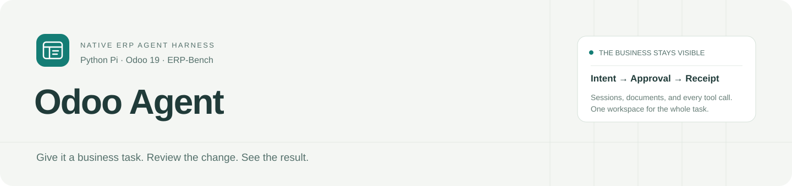
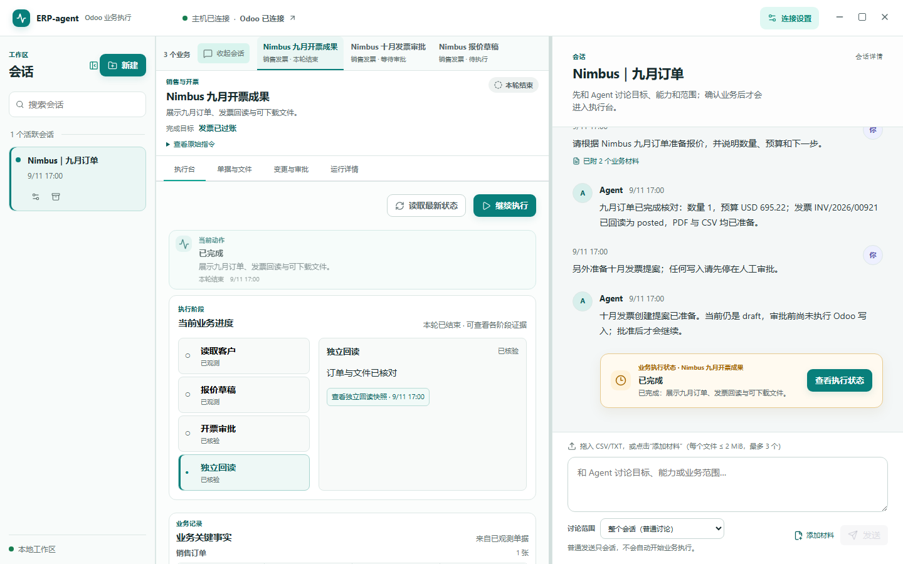
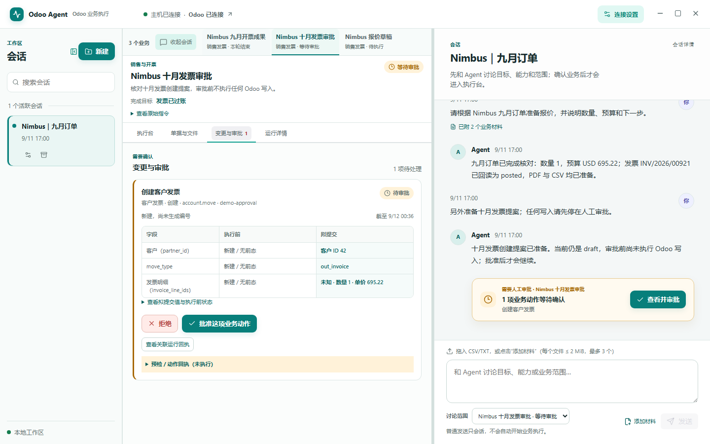
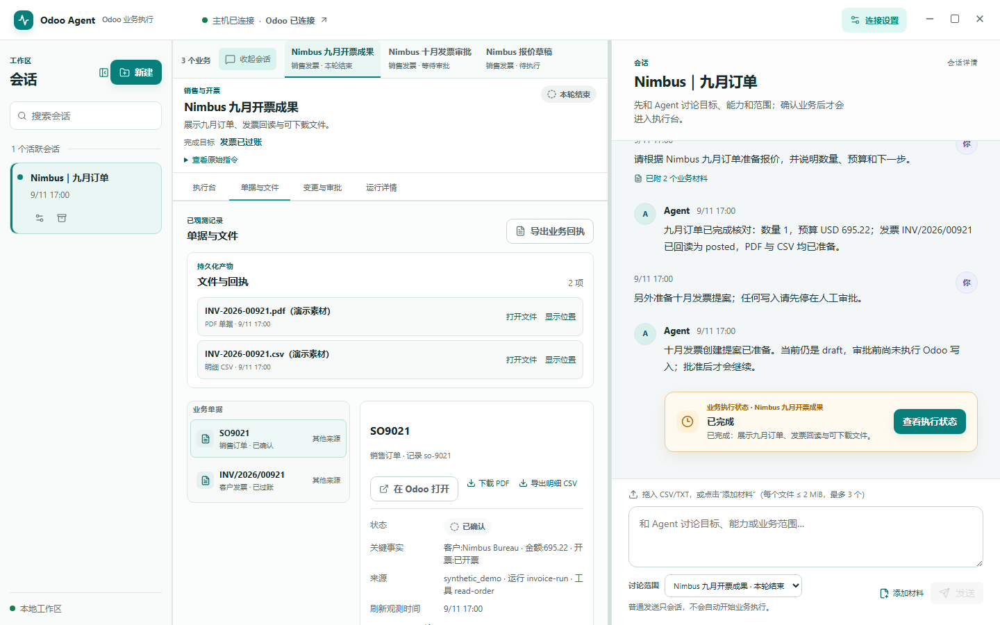
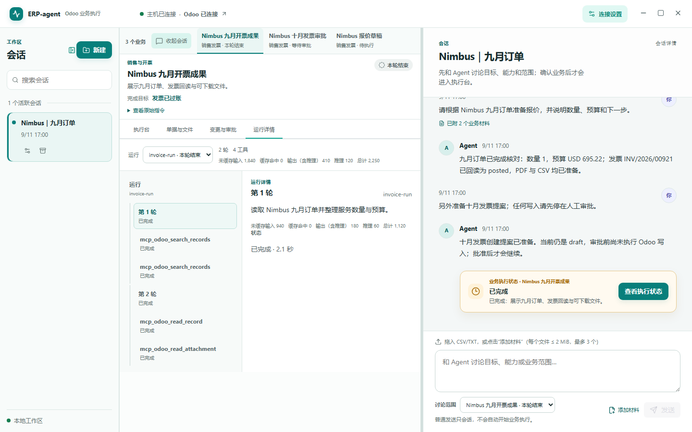
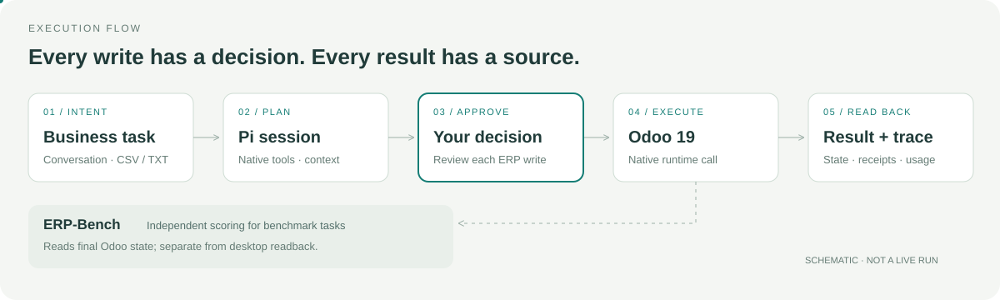

# ERP-agent

Native ERP Agent Harness

English · [简体中文](README.zh-CN.md)

[](LICENSE) [](https://github.com/Sanssssssssssssssss/ERP-agent/actions/workflows/checks.yml)

ERP-agent drafts proposed Odoo business actions, requests approval before writes, and checks the resulting records. The repository contains the Windows desktop workbench, its native Odoo 19 runtime, and the ERP-Bench research harness behind it.

**Windows preview · v0.5.4 · Odoo 19**



## Windows preview (0.5.4)

[Download the unsigned Windows preview](https://github.com/Sanssssssssssssssss/ERP-agent/releases/download/v0.5.4/Odoo-Workbench-0.5.4-windows-x64.zip) · [Release notes](https://github.com/Sanssssssssssssssss/ERP-agent/releases/tag/v0.5.4)

1. Download and unzip the archive, then run `Odoo-Workbench-0.5.4-portable.exe`.
2. Open connection settings and provide your Odoo 19 and model configuration.
3. Create a session, describe the business, and optionally attach a CSV/TXT file.

This is an unsigned preview. It needs your own Odoo 19 instance and model endpoint. The sample [`orders.csv`](experiments/desktop_workbench/fixtures/bench_2262_orders/orders.csv) matches the ERP-Bench 2262 seed data only; it is not a generic Odoo success sample.



Actual UI with synthetic data; the workflow graphic below is schematic.

<details>
<summary>Approval, document and trace views</summary>



Approval cards show the proposed action, pre-state, and per-action decision controls.



The documents view shows observed Odoo records and export actions.



Trace shows the recorded run, tools, and usage; screenshots use synthetic demo data.
</details>



The workflow graphic is schematic; the screenshots show the actual renderer UI.

[Quick start](#quick-start-windows-development) · [Boundaries](#boundaries) · [Repository map](#repository-map) · [Sources and contribution](#provenance-and-contribution)

## What it does

- Runs a Python Pi style session loop against native Odoo helpers in `odoo_runtime`.
- Provides a Windows Electron workbench for sales, purchasing, invoicing, approvals, readback, and run traces.
- Accepts UTF-8 CSV/TXT materials within the workbench limits, exports observed document lines as UTF-8 BOM CSV, and downloads an already-generated customer-invoice PDF when its Odoo attachment is available.
- Keeps ERP write actions behind per-action approval and records the pre-state, result, and independent readback.
- Carries the pinned ERP-Bench dataset and Harbor integration used by the research stages.

The current workbench business projections cover `sale_invoice`, `sale_purchase_invoice`, and `purchase`. The native runtime includes controlled SOP tools and native knowledge index/search/stats. The separate `experiments/company_records_rag` vector experiment is not connected to the Agent or workbench. ERP-Bench remains the independent scorer; a workbench readback is not an ERP-Bench score.

The desktop worker uses `native` execution with `dynamic` tools, `controlled` SOPs, and `record` world state. This source tree combines the desktop baseline with newer benchmark backend changes; the v0.5.4 download above is the earlier published preview. See [backend integration and validation boundaries](docs/backend-release.md) for the pinned inputs and offline checks. Benchmark `TaskEvidence` requires explicit host configuration and is not enabled by the desktop worker.

## Quick start: Windows development

Requirements: Windows, Node.js 22 or newer, and Python 3.13.

```powershell
git clone https://github.com/Sanssssssssssssssss/ERP-agent.git
cd ERP-agent

py -3.13 -m venv .venv
.\.venv\Scripts\python.exe -m pip install -e .\agent
.\.venv\Scripts\python.exe -m pip install -r .\desktop\requirements-host.txt

cd desktop
npm ci
$env:WORKBENCH_HOST_ROOT = (Resolve-Path ..).Path
$env:WORKBENCH_PYTHON = (Resolve-Path ..\.venv\Scripts\python.exe).Path
npm run dev
```

Open connection settings and provide the model endpoint and Odoo 19 JSON-2 details. Use HTTPS for network connections; localhost HTTP is intended for local development. The application does not start a model request just to check configuration.

Useful checks from `desktop/`:

```powershell
npm run typecheck
npm run self-check
npx playwright install chromium
node scripts/renderer-check.mjs
```

The Windows portable and installer commands are available in `desktop/package.json`. Packaging also requires the pinned sidecar inputs described by `desktop/scripts/prepare-sidecar.mjs` and `desktop/requirements-host.txt`.
For a clean clone, the sidecar reads `.venv\Lib\site-packages` by default and caches the pinned CPython archive under `.runtime\cache`; run `npm run prepare:sidecar` from `desktop/` before `npm run dist:portable`.

## Boundaries

- The native runtime does not start or import MCP in its accepted Stage 7 path. The pinned MCP tree is retained for provenance and historical control experiments.
- The native catalog keeps some `mcp_odoo_*` compatibility names; `integration/odoo_tools.py` strips that label before calling the native adapter, with no MCP transport.
- Odoo writes require explicit approval. An uncertain write moves to readback/reconciliation; it is not silently replayed or marked complete.
- PDF export is for an observed Odoo document. A down payment invoice or a posted invoice is not evidence that a bank payment occurred.
- Manufacturing planning/confirmation, banking, reconciliation, payroll, HR, OCR, and company-wide document retrieval are outside the current workbench claim unless a specific source and experiment says otherwise.
- The workbench accepts CSV/TXT materials. It does not claim a complete enterprise document index or production deployment.

## Repository map

| Path | Role |
| --- | --- |
| [`desktop/`](desktop/) | Windows Electron workbench, UI contract, and packaging scripts |
| [`workbench/`](workbench/) | Host session, approval, storage, materials, and business projection |
| [`odoo_runtime/`](odoo_runtime/) | Native Odoo helpers and runtime capabilities |
| [`integration/`](integration/) | Pi runner, native tool catalog, Harbor and report adapters |
| [`bench/`](bench/) | ERP-Bench tasks, schemas, and Harbor integration |
| [`configs/`](configs/) | Stage and baseline experiment configurations |
| [`experiments/`](experiments/) | Stage evidence, limits, and historical research notes |
| [`sources.lock.json`](sources.lock.json) | Pinned source commits, licenses, trees, and bundle hashes |

The previous lab entry point remains in [`docs/history/README-lab.md`](docs/history/README-lab.md), with repository-relative links adjusted for the archive location.

## Provenance and contribution

The repository combines locally written harness code with pinned source material listed in [`sources.lock.json`](sources.lock.json). Check the relevant [`LICENSE`](LICENSE), [`THIRD_PARTY_NOTICES.md`](THIRD_PARTY_NOTICES.md), and [`agent/THIRD_PARTY_NOTICES.md`](agent/THIRD_PARTY_NOTICES.md) before redistributing a component. See [`CONTRIBUTING.md`](CONTRIBUTING.md) and [`SECURITY.md`](SECURITY.md).
