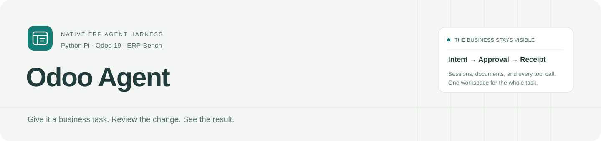
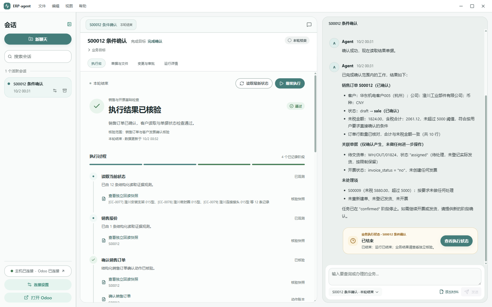
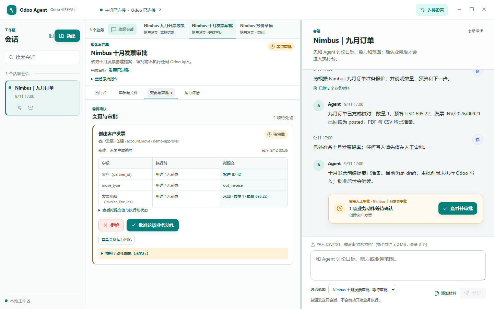
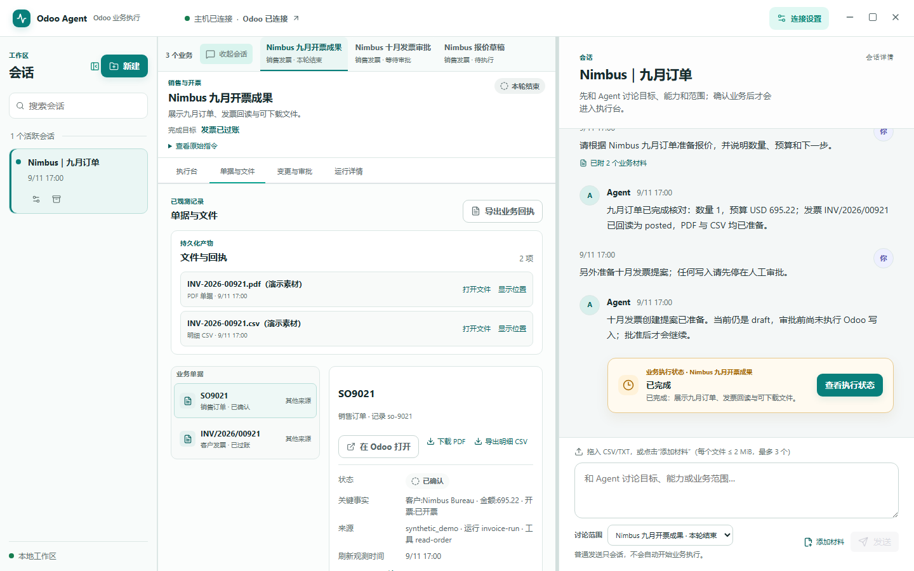
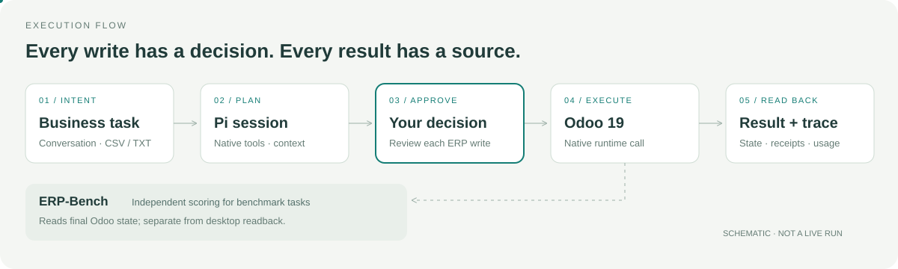

# ERP-agent

**A safety-first Agent workbench for real Odoo business operations.**

ERP-agent lets an AI Agent propose ERP changes, pause for human approval before writes, execute against Odoo 19, and verify the resulting records with independent readback. It combines a native Python runtime, a Windows desktop workbench, recoverable execution state, and ERP-Bench evaluation.

[简体中文](README.zh-CN.md)

**Windows preview · v0.6.0 · Odoo 19**

[Download Windows preview](https://github.com/Sanssssssssssssssss/ERP-agent/releases/download/v0.6.0/Odoo-Workbench-0.6.0-windows-x64.zip) · [Release notes](https://github.com/Sanssssssssssssssss/ERP-agent/releases/tag/v0.6.0) · [Validation ledger](docs/enterprise-validation.md) · [Tests by capability](TESTING.md)

> Building Agents that can change business systems is mainly a control problem: what may be written, when approval is required, how interrupted work resumes, and how the final state is verified. ERP-agent is built around those constraints.

If this direction is useful to your work, star or watch the repository to follow releases and validation updates.

## Why ERP-agent

Most Agent demos stop at tool calling. ERP-agent focuses on the harder path after a model decides to act.

| Capability | What is implemented |
| --- | --- |
| **Controlled ERP writes** | Every supported write is proposed first, requires explicit approval, records pre-state, and is followed by readback. |
| **Recoverable execution** | Interrupted business sessions can resume from persisted state instead of silently restarting the workflow. |
| **Native Odoo runtime** | The accepted runtime path calls native Odoo helpers directly and exposes tools dynamically to the Agent. |
| **Business-state verification** | The workbench separates intended actions, execution results, observed records, and independent evaluation. |
| **Human-in-the-loop** | Approval is part of the runtime contract rather than a front-end-only confirmation dialog. |
| **Persistent memory** | Identity-scoped long-term memory and BM25 knowledge retrieval are available, with long-term memory disabled by default. |
| **Independent evaluation** | ERP-Bench and Harbor adapters evaluate Agent behavior separately from the workbench readback path. |
| **Desktop operator surface** | The Electron workbench exposes approvals, business documents, run traces, exports, and recovery flows. |

The current workbench business projections cover sale_invoice, sale_purchase_invoice, purchase, inventory, manufacturing, payment, refund, and reconciliation.

## See the execution loop

The screenshot above is the actual renderer UI with synthetic data. The runtime flow is:

~~~text
User intent
    ↓
Agent plans business actions
    ↓
Read current Odoo state
    ↓
Propose write actions
    ↓
Human approval
    ↓
Execute approved writes
    ↓
Independent readback / reconciliation
    ↓
Documents, trace and final response
~~~

Approval, document and trace views

Approval cards show the proposed action, pre-state, and per-action decision controls.

The documents view shows observed Odoo records and export actions.

Trace records the run, tools, and usage. Screenshots use synthetic demo data.

## Validation, not just a demo

The repository includes a standard validation enterprise with an isolated Chinese/CNY Odoo company pair, role accounts, and 10,000 source documents. Its [acceptance ledger](docs/enterprise-validation.md) records actual results and remaining gates.

ERP-Bench remains an independent scorer. A successful workbench readback is evidence that the expected Odoo state was observed; it is not treated as an ERP-Bench score.

The repository also carries the pinned ERP-Bench dataset, Harbor integration, experiment configurations, regression tests, and provenance metadata used during development.

## Windows preview

The v0.6.0 package includes the integrated backend and interrupted-business recovery.

1. [Download the unsigned Windows preview](https://github.com/Sanssssssssssssssss/ERP-agent/releases/download/v0.6.0/Odoo-Workbench-0.6.0-windows-x64.zip).
2. Unzip it and run Odoo-Workbench-0.6.0-portable.exe.
3. Open connection settings and provide your Odoo 19 and model configuration.
4. Create a session, describe the business task, and optionally attach a CSV/TXT file.

The preview requires your own Odoo 19 instance and model endpoint. The sample [orders.csv](experiments/desktop_workbench/fixtures/bench_2262_orders/orders.csv) matches the ERP-Bench 2262 seed data only; it is not a generic Odoo success sample.

## What the workbench can do

- Run the integrated Agent session loop, providers, context assembly, dynamic tools, and native Odoo helpers in [src/erp_harness](src/erp_harness).
- Handle sales, purchasing, invoicing, approvals, inventory, manufacturing, payments, refunds, reconciliation, readback, and run traces within the validated projections.
- Accept UTF-8 CSV/TXT materials within the workbench limits.
- Export observed document lines as UTF-8 BOM CSV.
- Download an already-generated customer-invoice PDF when the corresponding Odoo attachment is available.
- Keep supported ERP writes behind per-action approval.
- Record pre-state, execution result, observed state, and trace evidence.
- Use controlled SOP tools and persistent identity-scoped BM25 knowledge search.
- Run ERP-Bench and Harbor-backed evaluation separately from the operator workbench.

The separate experiments/company_records_rag vector experiment is not connected to the Agent or workbench.

## Quick start for development

Requirements: Windows, Node.js 22 or newer, Python 3.13, and uv.

~~~powershell
git clone https://github.com/Sanssssssssssssssss/ERP-agent.git
cd ERP-agent

uv sync --locked

cd desktop
npm ci
$env:WORKBENCH_HOST_ROOT = (Resolve-Path ..).Path
$env:WORKBENCH_PYTHON = (Resolve-Path ..\.venv\Scripts\python.exe).Path
npm run dev
~~~

Open connection settings and provide the model endpoint and Odoo 19 JSON-2 details. Use HTTPS for network connections; localhost HTTP is intended for local development. The application does not start a model request just to check configuration.

Useful checks from desktop/:

~~~powershell
npm run typecheck
npm run self-check
npx playwright install chromium
node scripts/renderer-check.mjs
~~~

The Windows portable and installer commands are available in desktop/package.json. Packaging also requires the pinned sidecar inputs described by desktop/scripts/prepare-sidecar.mjs and desktop/requirements-host.txt.

Build the backend wheel first and prepare an environment without development dependencies. Exact build, verification, and rollback commands are in the [development guide](docs/development.zh-CN.md).

## Repository map

| Path | Role |
| --- | --- |
| [desktop/](desktop/) | Windows Electron workbench, UI contract, and packaging scripts |
| [src/erp_harness/app/](src/erp_harness/app/) | Host session, approval, storage, materials, and business projection |
| [src/erp_harness/erp/](src/erp_harness/erp/) | Native Odoo helpers and runtime capabilities |
| [src/erp_harness/](src/erp_harness/) | Integrated session runtime, providers, context, memory, and tools |
| [tests/](tests/) | Runtime, capability, recovery, routing, and regression tests |
| [bench/adapters/](bench/adapters/) | Harbor, scoring, snapshot, and report adapters |
| [bench/](bench/) | ERP-Bench tasks, schemas, and Harbor integration |
| [bench/configs/](bench/configs/) | Stage and baseline experiment configurations |
| [experiments/](experiments/) | Validation evidence, limits, and historical research notes |
| [sources.lock.json](sources.lock.json) | Pinned source commits, licenses, trees, and bundle hashes |

The previous lab entry point remains in [docs/history/README-lab.md](docs/history/README-lab.md).

## Boundaries

ERP-agent is a preview and research-backed engineering project, not a claim of complete ERP production coverage.

- The accepted native runtime path does not start or import MCP. The pinned MCP tree is retained for provenance and historical control experiments.
- Some native catalog entries keep mcp_odoo_* compatibility names; src/erp_harness/tools/router.py strips that label before calling the native adapter.
- Odoo writes require explicit approval. An uncertain write moves to readback/reconciliation; it is not silently replayed or marked complete.
- PDF export is limited to an observed Odoo document. A down-payment invoice or posted invoice is not evidence that a bank payment occurred.
- Manufacturing, stock transfers, payments, refunds, and reconciliation are validated against the local synthetic enterprise described above.
- Real bank/tax integrations, payroll, HR, OCR, and complete enterprise document indexing are outside the current validation scope.
- The workbench accepts CSV/TXT materials and does not claim a complete production deployment.

## Provenance and contribution

The repository combines locally written harness code with pinned source material listed in [sources.lock.json](sources.lock.json). Check [LICENSE](LICENSE), [THIRD_PARTY_NOTICES.md](THIRD_PARTY_NOTICES.md), and [docs/licenses/pi-agent-NOTICES.md](docs/licenses/pi-agent-NOTICES.md) before redistributing a component.

See [CONTRIBUTING.md](CONTRIBUTING.md) for contribution guidance and [SECURITY.md](SECURITY.md) for security reporting.
