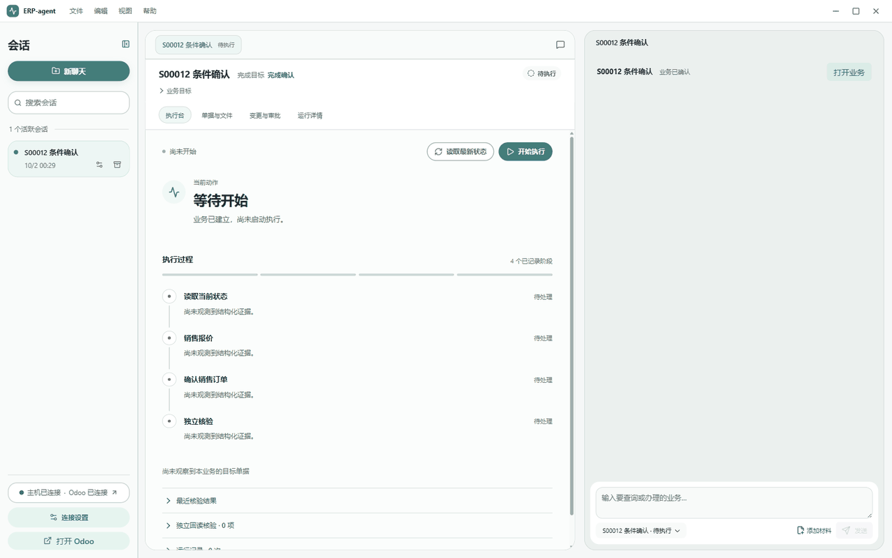
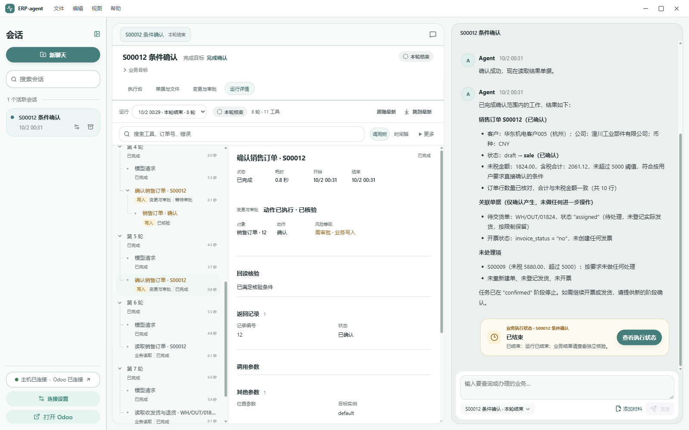

<p align="center"></p>
<h1 align="center">ERP-agent</h1>
<h3 align="center">An AI Agent that can actually operate your ERP.</h3>
<p align="center">Give it a business goal. Review the changes. See what actually happened in Odoo.</p>
<p align="center"><a href="#demo">Demo</a> · <a href="#try-it">Try it</a> · <a href="docs/development.zh-CN.md">Docs</a> · <a href="TESTING.md">Tests</a> · <a href="README.zh-CN.md">简体中文</a></p>
<p align="center"><a href="LICENSE"></a> <a href="https://github.com/Sanssssssssssssssss/ERP-agent/actions/workflows/checks.yml"></a>  </p>

## Demo



> “Confirm S00012 if its untaxed amount is under 5,000 CNY. Leave S00009 alone. No shipment or invoice.”

The agent reads the order, requests approval for the exact change, executes the approved action, and reads the result back. The execution desk keeps the goal, current action, approvals and evidence together; chat stays alongside it.

The condensed demo shows recorded states from a real model/API run against an isolated Odoo test company. [Validation results](docs/ui-integration-20261002.md) distinguish this desktop workflow from the three ERP-Bench tasks used to check the integrated backend.

**Sales · Purchasing · Inventory · Manufacturing · Invoicing · Payments · Refunds · Reconciliation**

## From a request to an ERP result

- **Describe the work.** Ask questions in chat, then confirm the business goal and scope.
- **Follow execution.** See the current action and progress, live model messages and observed documents.
- **Review before changes.** Approval shows affected records, proposed values and current state. Approve, reject or request a revision from the execution desk.
- **Inspect the result.** Read verification first; open Trace for readable tool names, parameters, risk, results and original receipts.

Business state, approvals and action receipts persist across interruptions. An uncertain write requires reconciliation before further execution. Tool availability follows the current task; field access and action approval remain explicit.



## Try it

Bring your own **Odoo 19 JSON-2 connection** and **model endpoint**.

The redesigned desktop shown above is available from source. The published [Windows v0.6.0 preview](https://github.com/Sanssssssssssssssss/ERP-agent/releases/download/v0.6.0/Odoo-Workbench-0.6.0-windows-x64.zip) contains the earlier UI; [release notes](https://github.com/Sanssssssssssssssss/ERP-agent/releases/tag/v0.6.0) describe that build.

### Run from source on Windows

Requirements: Node.js 22+, Python 3.13 and [uv](https://docs.astral.sh/uv/).

```powershell
git clone https://github.com/Sanssssssssssssssss/ERP-agent.git
cd ERP-agent
uv sync --locked

cd desktop
npm ci
$env:WORKBENCH_HOST_ROOT = (Resolve-Path ..).Path
$env:WORKBENCH_PYTHON = (Resolve-Path ..\.venv\Scripts\python.exe).Path
npm run dev
```

Open **Connection settings**, enter Odoo and model credentials, and start a new chat. Attach CSV, TXT, XLSX, PDF or images as reference material. Settings include dark appearance, reduced motion and chat storage location. Printed-document extraction runs locally; spreadsheet formulas are not evaluated.

For a reproducible local company, see the [persistent demo](experiments/demo_odoo/README.md) and [10,000-document validation fixture](experiments/enterprise_validation/README.md). The sample [orders.csv](experiments/desktop_workbench/fixtures/bench_2262_orders/orders.csv) specifically matches the ERP-Bench 2262 seed.

### Development checks

```powershell
npm run typecheck
npm run self-check
npx playwright install chromium
node scripts/renderer-check.mjs
npm run check:execution
npm run check:trace
```

Backend checks and coverage are indexed in [TESTING.md](TESTING.md). Packaging instructions, pinned sidecar inputs and rollback commands are in the [development guide](docs/development.zh-CN.md).

## Runtime and validation

The desktop runs the native Python Harness with dynamic tools, controlled business procedures and recorded world state. It connects directly to Odoo; historical MCP comparison code remains in the research tree. Identity-scoped BM25 knowledge search is integrated. [Long-term memory](docs/long-term-memory.md) is optional and defaults to off; the separate vector RAG experiment is not connected to the desktop.

The workflow families above have local test coverage; specific acceptance and remaining limitations are documented in the [enterprise ledger](docs/enterprise-validation.md), [manual business results](docs/manual-business-results.md) and [backend validation](docs/backend-release.md). These fixtures do not establish production bank, tax or HR integration. A posted invoice is not proof of payment, and a verified Odoo state is not a benchmark score.

[ERP-Bench and Harbor](bench/) provide a separate evaluation path with pinned tasks, snapshots and scoring. Mock and renderer checks verify UI mechanisms; real API runs and Odoo readbacks verify the recorded test workflows.

[Tool recovery validation](docs/tool-self-debug-20261003.md) records the failure causes, local API decisions, fresh business runs and token usage for each case.

## Repository

| Path | Purpose |
| --- | --- |
| [desktop/](desktop/) | Electron application, React UI, IPC and packaging |
| [src/erp_harness/app/](src/erp_harness/app/) | Sessions, execution, approvals, materials and business views |
| [src/erp_harness/erp/](src/erp_harness/erp/) | Native Odoo reads, writes, policy and verification |
| [src/erp_harness/](src/erp_harness/) | Agent runtime, providers, context and tools |
| [bench/](bench/) | ERP-Bench, Harbor adapters and frozen configurations |
| [experiments/](experiments/) | Reproducible controls, evidence and research notes |

## Sources and contribution

Original integration code is MIT. Adapted components retain their own licenses and pinned provenance in [sources.lock.json](sources.lock.json), [THIRD_PARTY_NOTICES.md](THIRD_PARTY_NOTICES.md) and [UI source notices](docs/licenses/execution-ui-NOTICES.md).

See [CONTRIBUTING.md](CONTRIBUTING.md), [SECURITY.md](SECURITY.md) and the [historical lab entry](docs/history/README-lab.md).
